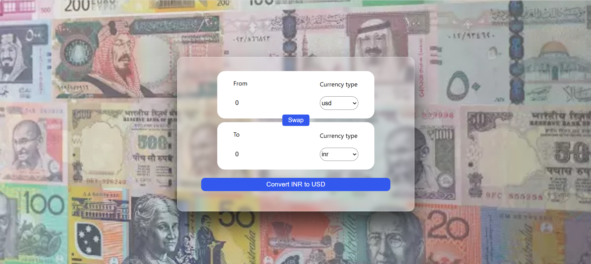
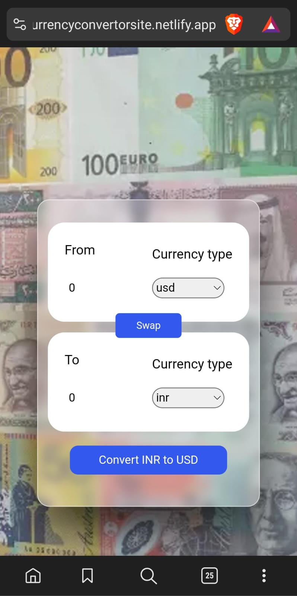

# Currency Converter

## Overview
The **Currency Converter** is a web application built entirely using React. It allows users to convert amounts from one country's currency to another. Users can select currencies, input amounts, and view the converted value. The site also features a swapping functionality to quickly switch between the selected currencies.

### Live Demo
Check out the live project here: [Currency Converter](https://currencyconvertorsite.netlify.app/)

---

## Features
1. **Currency Conversion**: Convert a specified amount from one currency to another.
2. **Country Selection**: Users can select source and target currencies from dropdown menus.
3. **Swap Functionality**: A convenient button to swap the selected currencies.
4. **Responsive Design**: Fully optimized for both desktop and mobile devices for a seamless experience.

---

## Technologies Used
- **React**: Frontend library for building the user interface and managing state.
- **CSS**: Styling for the interface, including responsive design for mobile devices.
- **Netlify**: Deployment platform for hosting the live project.

---

## Installation
If you want to run the project locally, follow these steps:

1. Clone the repository:
   ```bash
   git clone <repository-link>
   ```
2. Navigate to the project directory:
   ```bash
   cd currency-converter
   ```
3. Install dependencies:
   ```bash
   npm install
   ```
4. Start the development server:
   ```bash
   npm start
   ```
5. Open `http://localhost:3000` in your browser to view the application.

---

## Usage
1. Open the application using the [live demo link](https://currencyconvertorsite.netlify.app/).
2. Enter the amount in the input field.
3. Select the source currency from the first dropdown.
4. Select the target currency from the second dropdown.
5. Click the **Convert** button to see the converted value.
6. Use the **Swap** button to quickly interchange the source and target currencies.

---

## Screenshots
### Desktop View:


### Mobile View:



---

## License
This project is open-source and available under the [MIT License](LICENSE).

---

## Acknowledgments
- Currency API used :https://cdn.jsdelivr.net/npm/@fawazahmed0/currency-api@latest/v1/currencies/${currency}.json


